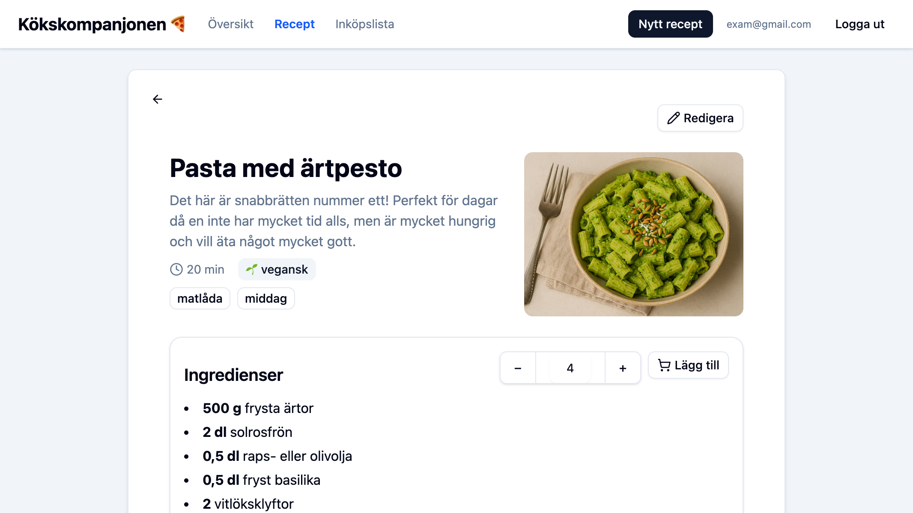
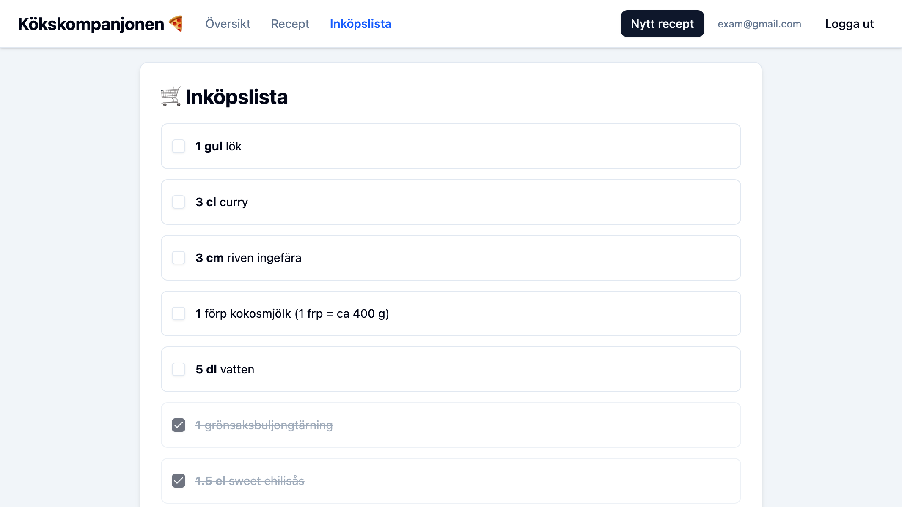

# 🧑‍🍳 Kökskompanjonen / Kitchen Pal 

**Kökskompanjonen** is a personal recipe manager that lets you save, edit, and organize your favorite recipes – and generate grocery lists with one click. It's designed for meal planning, smart cooking, and even shared shopping across devices.

## Live Demo

[https://kitchen-pal-c0b19.web.app/](https://kitchen-pal-c0b19.web.app/)

## Features

- Save and view your own recipes 
- Adjust servings – ingredients scale automatically
- Search recipes by title, ingredient, or tag
- Create grocery lists from recipes (auto-merge & unit conversion)
- Real-time list sync between devices
- Secure login with Firebase Authentication
- Responsive design – works on both mobile and desktop

## Screenshots

| Recipe List | Recipe Details | Shopping List |
|----------|----------------|----------------|
|  |  |  |


## Tech Stack

| Technology                               | Purpose                                                      |
|------------------------------------------|--------------------------------------------------------------|
| [React](https://react.dev/)              | Frontend framework                                           |
| [Vite](https://vite.dev/)                | Fast dev environment                                         |
| [Firebase](https://firebase.google.com/) | Backend (Authentication, Firestore, Storage, Hosting)        |
| [Zustand](https://zustand-demo.pmnd.rs/) | State management (shopping list)                             |
| [Tailwind CSS](https://tailwindcss.com/) | Styling and layout                                           |
| [Shadcn UI](https://ui.shadcn.com/)      | Modern, accessible UI components                             |

## Getting Started
1. Clone the project

```
git clone https://github.com/miba999/1dv613-kitchen-pal.git
cd kitchen-pal
```

2. Install dependencies

```
npm install
```

3. Add your environment config

```
cp example.env .env
```
See more under section [Environment Configuration](#-environment-configuration)

4. Start development server
```
npm run dev
```


## Environment Configuration

This project uses Firebase and Vite, and requires a `.env` file with environment variables to run locally.

### Step 1: Create a `.env` File

Copy the example file:
```bash
cp example.env .env
```

### Step 2: Fill in Your Firebase Config
Edit the .env file and replace the placeholders with your actual Firebase project settings. You can find these in your Firebase console under:

> Project Settings → General → Your Apps

Example `.env` Format:
```env
VITE_APIKEY=your-firebase-api-key
VITE_AUTHDOMAIN=your-project-id.firebaseapp.com
VITE_PROJECTID=your-project-id
VITE_STORAGEBUCKET=your-project-id.appspot.com
VITE_MESSAGINGSENDERID=your-messaging-sender-id
VITE_APPID=your-firebase-app-id
```

**What These Mean**:

| Variable                 | Description                                      |
| ------------------------ | ------------------------------------------------ |
| `VITE_APIKEY`            | Public API key from Firebase project             |
| `VITE_AUTHDOMAIN`        | Auth domain like `project-id.firebaseapp.com`    |
| `VITE_PROJECTID`         | Your Firebase project ID                         |
| `VITE_STORAGEBUCKET`     | Storage bucket name (usually same as project ID) |
| `VITE_MESSAGINGSENDERID` | Firebase Cloud Messaging sender ID               |
| `VITE_APPID`             | Unique app ID for your Firebase app              |

Your `.env` file contains sensitive data and **should not be committed** to version control. It is listed in `.gitignore` by default. Always keep your credentials private.

## About the Project
This app was built as part of a 10-week university course (1DV613 Software Development Project at Linnaeus University), but is continued as a portfolio project. 

## License
This project is licensed under the MIT License. See the [LICENSE](/LICENSE) file for details.

## Author
- GitHub: [@miba999](https://github.com/miba999)